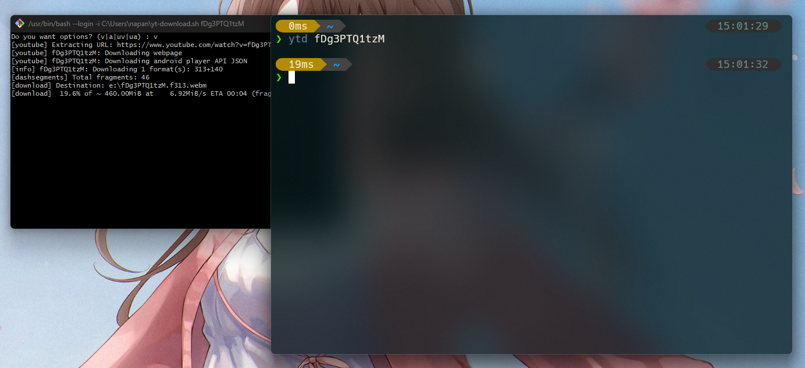

## 👻 requirement

- git
- python
- yt-dlp
- ffmpeg

## 🐻‍❄️ how to use

- open terminal
- copy and paste in terminal `git clone https://github.com/Jirateep12/yt-download.git ~\yt-download`
- and then move file `yt-download.sh` out of folder
- and then run `yt-download.sh ...` (... is the url youtube behind v= but you can only use options for v or a) or (... is the url youtube but you can only use options for uv or ua)

